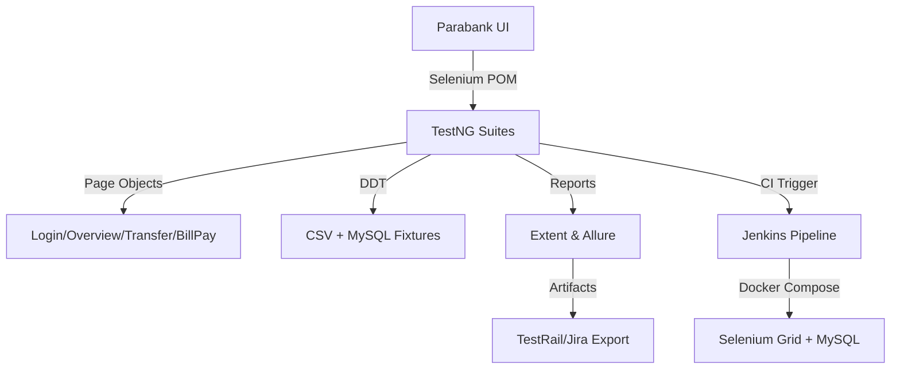

- UI flows chain through strongly typed page objects for encapsulation.
- CSV + SQL seeds drive permutations; MySQL ready for future DB verification steps.
- Reporting listener attaches screenshots to both Extent & Allure outputs.
- Jenkins orchestrates Dockerized grid + DB, then archives artifacts for auditors.
